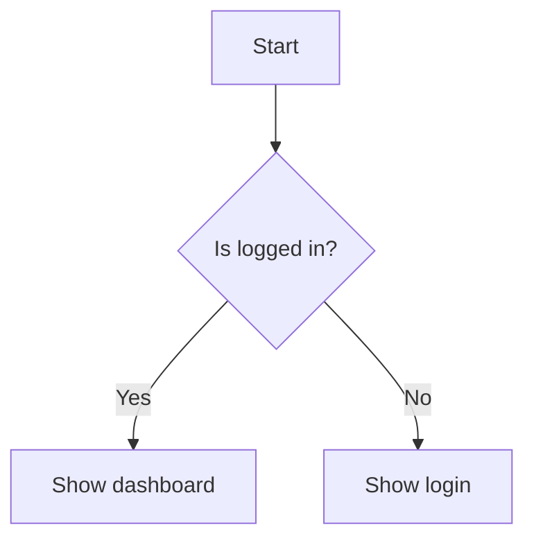
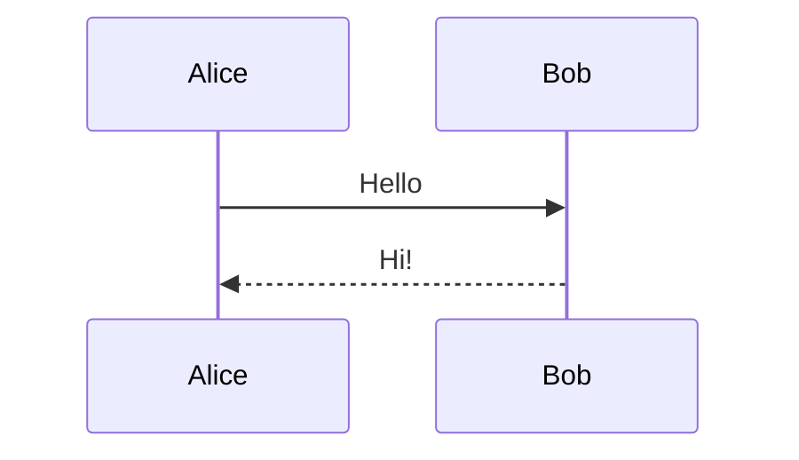
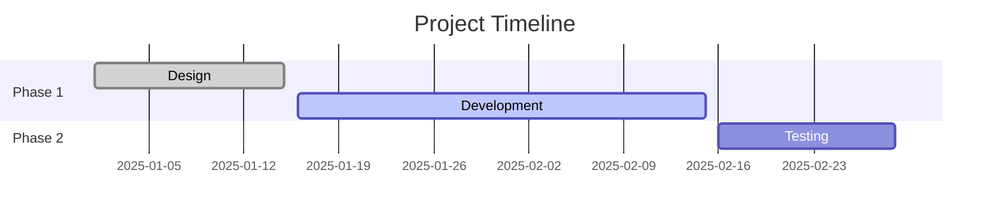

# MarkdStudio Markdown Reference

Full syntax reference for writing Markdown in MarkdStudio.

---

## Table of Contents

- [Headings](#headings)
- [Paragraphs](#paragraphs)
- [Text Formatting](#text-formatting)
- [Lists](#lists)
- [Links](#links)
- [Images](#images)
- [Blockquotes](#blockquotes)
- [Code](#code)
- [Tables](#tables)
- [Horizontal Rules](#horizontal-rules)
- [Math (KaTeX)](#math-katex)
- [Diagrams (Mermaid)](#diagrams-mermaid)
- [Callouts](#callouts)
- [Footnotes](#footnotes)
- [Task Lists](#task-lists)
- [Emoji](#emoji)
- [HTML Tags](#html-tags)
- [Escaping Characters](#escaping-characters)

---

## Headings

```
# H1 — Document title
## H2 — Major section
### H3 — Subsection
#### H4 — Minor subsection
##### H5 — Rarely needed
###### H6 — Rarely needed
```

> [!NOTE]
> Use only one H1 per document. Do not skip heading levels.

---

## Paragraphs

Separate paragraphs with a blank line.

```
This is the first paragraph.

This is a second paragraph.
```

For a line break within a paragraph, end the line with two spaces or use `\`:

```
Line one  
Line two
```

---

## Text Formatting

| Syntax | Result |
| ------ | ------ |
| `**bold**` | **bold** |
| `*italic*` | *italic* |
| `~~strikethrough~~` | ~~strikethrough~~ |
| `` `inline code` `` | `inline code` |
| `**_bold italic_**` | ***bold italic*** |

---

## Lists

**Unordered list:**

```
- item one
- item two
  - nested item
  - nested item
- item three
```

**Ordered list:**

```
1. First step
2. Second step
   1. Sub-step
   2. Sub-step
3. Third step
```

**Task list:**

```
- [x] Done
- [ ] Not done
- [ ] In progress
```

> [!TIP]
> Use `-` consistently for bullet markers. Do not mix `-` and `*` in the same list.

---

## Links

```
[Link text](https://example.com)
[Link with title](https://example.com "Tooltip text")
[Reference link][ref]

[ref]: https://example.com
```

Autolinks:

```
<https://example.com>
<user@example.com>
```

---

## Images

```


```

Reference style:

```
![Alt text][img]

[img]: image.png "Optional title"
```

> [!IMPORTANT]
> Always include descriptive alt text for accessibility.

---

## Blockquotes

```
> Single-level quote.

> Nested quote:
>> This is nested.

> Multi-line quote
> continues here.
```

---

## Code

**Inline code:**

```
Use `npm install` to install dependencies.
```

**Fenced code block:**

````
```bash
npm install my-package
```
````

**Common language labels:**

| Label | Language |
| ----- | -------- |
| `js` | JavaScript |
| `ts` | TypeScript |
| `python` | Python |
| `bash` | Shell / Bash |
| `html` | HTML |
| `css` | CSS |
| `json` | JSON |
| `yaml` | YAML |
| `sql` | SQL |
| `markdown` | Markdown |
| `diff` | Diff output |
| `plaintext` | No highlighting |

> [!WARNING]
> Always include a language label. Unlabeled blocks lose syntax highlighting.

---

## Tables

```
| Name    | Role       | Status  |
| ------- | ---------- | ------- |
| Alice   | Developer  | Active  |
| Bob     | Designer   | Active  |
| Carol   | Manager    | On leave|
```

Alignment:

```
| Left  | Center  | Right  |
| :---- | :-----: | -----: |
| text  |  text   |   text |
```

---

## Horizontal Rules

Use three or more dashes, asterisks, or underscores on a blank line:

```
---
```

---

## Math (KaTeX)

**Inline math** — wrap with single `$`:

```
The formula is $E = mc^2$.
```

**Block math** — wrap with `$$`:

```
$$
\frac{-b \pm \sqrt{b^2 - 4ac}}{2a}
$$
```

**Common operators:**

| Syntax | Output |
| ------ | ------ |
| `\frac{a}{b}` | Fraction |
| `\sqrt{x}` | Square root |
| `x^{2}` | Superscript |
| `x_{i}` | Subscript |
| `\sum_{i=1}^{n}` | Summation |
| `\int_0^\infty` | Integral |
| `\alpha \beta \gamma` | Greek letters |
| `\pi \sigma \theta` | More Greek |

---

## Diagrams (Mermaid)

Wrap diagrams in a fenced code block with the `mermaid` language label.

**Flowchart:**

````

````

**Sequence diagram:**

````

````

**Gantt chart:**

````

````

---

## Callouts

```
> [!NOTE]
> Informational side note.

> [!TIP]
> Helpful suggestion.

> [!WARNING]
> Important warning to be aware of.

> [!IMPORTANT]
> Critical information the user must not miss.

> [!CAUTION]
> Potential risk or destructive action.
```

---

## Footnotes

```
Main text with a reference.[^1]

Another reference.[^note]

[^1]: This is the first footnote.
[^note]: This is a named footnote.
```

---

## Task Lists

```
## Sprint Backlog

- [x] Set up repository
- [x] Configure CI/CD pipeline
- [ ] Write unit tests
- [ ] Deploy to staging
```

---

## Emoji

Use shortcode syntax:

```
:rocket: :sparkles: :white_check_mark: :warning: :bulb: :fire:
```

Common shortcodes:

| Code | Emoji |
| ---- | ----- |
| `:rocket:` | 🚀 |
| `:sparkles:` | ✨ |
| `:white_check_mark:` | ✅ |
| `:warning:` | ⚠️ |
| `:bulb:` | 💡 |
| `:fire:` | 🔥 |
| `:x:` | ❌ |
| `:memo:` | 📝 |

---

## HTML Tags

Use sparingly, only when Markdown cannot express the structure.

| Tag | Purpose | Example |
| --- | ------- | ------- |
| `<kbd>` | Keyboard key | <kbd>Ctrl+S</kbd> |
| `<mark>` | Highlighted text | <mark>important</mark> |
| `<sup>` | Superscript | text<sup>1</sup> |
| `<sub>` | Subscript | H<sub>2</sub>O |
| `<details>` | Collapsible section | See below |

**Collapsible section:**

```html
<details>
<summary>Click to expand</summary>

Hidden content goes here.

</details>
```

---

## Escaping Characters

Use a backslash `\` to escape Markdown special characters:

```
\*not italic\*
\# not a heading
\[not a link\]
```

Special characters that can be escaped:

`\ ` `` ` `` `*` `_` `{}` `[]` `()` `#` `+` `-` `.` `!`
