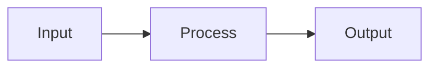

# MarkdStudio — Document Templates

Reusable Markdown templates. Copy the template you need and fill in the placeholders.

Placeholders use `[ALL CAPS IN BRACKETS]`.

---

## Table of Contents

- [README Template](#readme-template)
- [Blog Post Template](#blog-post-template)
- [Technical Documentation Template](#technical-documentation-template)
- [Meeting Notes Template](#meeting-notes-template)
- [Project Plan Template](#project-plan-template)
- [Tutorial Template](#tutorial-template)
- [Changelog Template](#changelog-template)
- [API Reference Template](#api-reference-template)

---

## README Template

````markdown
# [PROJECT NAME]

[ONE-LINE DESCRIPTION OF WHAT THE PROJECT DOES]

## Overview

[2–3 sentence description of the project, who it is for, and what problem it solves.]

## Features

- [Feature one]
- [Feature two]
- [Feature three]

## Requirements

- [Runtime or dependency, e.g., Node.js 18+]
- [Another requirement]

## Installation

```bash
[INSTALL COMMAND, e.g., npm install project-name]
```

## Usage

```[LANGUAGE]
[BASIC USAGE CODE EXAMPLE]
```

## Configuration

| Option | Type | Default | Description |
| ------ | ---- | ------- | ----------- |
| [option] | [type] | [default] | [description] |

## Contributing

Pull requests are welcome. For major changes, open an issue first to discuss.

## License

[LICENSE NAME] © [YEAR] [AUTHOR NAME]
````

---

## Blog Post Template

````markdown
# [POST TITLE]

*Published: [DATE] · [READING TIME] min read*

---

## Introduction

[Hook — start with a question, statistic, or short story. 2–3 sentences.]

[State what the reader will learn or get out of this post.]

---

## [MAIN SECTION 1]

[Content. Use short paragraphs, bullet points, and code examples where relevant.]

---

## [MAIN SECTION 2]

[Content.]

> [!TIP]
> [Any key insight to highlight here.]

---

## [MAIN SECTION 3]

[Content.]

```[LANGUAGE]
[Code example if relevant]
```

---

## Summary

[Recap the main points in 3–5 bullet points.]

- [Key point 1]
- [Key point 2]
- [Key point 3]

---

## What's Next

[Optional: suggest a next article, further reading, or an action to take.]

---

*[AUTHOR NAME] — [BRIEF BIO OR LINK]*
````

---

## Technical Documentation Template

````markdown
# [FEATURE OR SYSTEM NAME]

> [!NOTE]
> [Any important prerequisite or version requirement.]

## Overview

[Explain what this feature or system does and why it exists.]

## How It Works

[Brief conceptual explanation. Use a diagram if helpful.]



## Setup

### Prerequisites

- [Requirement 1]
- [Requirement 2]

### Installation

```bash
[SETUP COMMANDS]
```

### Configuration

```[yaml/json/env]
[CONFIGURATION EXAMPLE]
```

## Usage

### Basic Usage

```[LANGUAGE]
[SIMPLE USAGE EXAMPLE]
```

### Advanced Usage

```[LANGUAGE]
[MORE COMPLEX EXAMPLE]
```

## Options and Parameters

| Parameter | Type | Required | Default | Description |
| --------- | ---- | -------- | ------- | ----------- |
| [param] | [type] | Yes/No | [default] | [description] |

## Troubleshooting

> [!WARNING]
> [Common mistake or gotcha.]

**Problem:** [Description of a common error]
**Solution:** [How to fix it]

---

**Problem:** [Another common error]
**Solution:** [How to fix it]

## Related

- [Related doc 1]
- [Related doc 2]
````

---

## Meeting Notes Template

````markdown
# [MEETING TITLE] — [DATE]

**Attendees:** [NAMES]
**Facilitator:** [NAME]
**Location / Call:** [IN PERSON / VIDEO LINK]

---

## Agenda

1. [Agenda item 1]
2. [Agenda item 2]
3. [Agenda item 3]

---

## Discussion

### [Agenda Item 1]

[Notes on what was discussed, decisions reached.]

### [Agenda Item 2]

[Notes.]

### [Agenda Item 3]

[Notes.]

---

## Decisions

- [Decision 1]
- [Decision 2]

---

## Action Items

- [ ] [What needs to be done] (@[OWNER], due [DATE])
- [ ] [What needs to be done] (@[OWNER], due [DATE])
- [ ] [What needs to be done] (@[OWNER], due [DATE])

---

## Next Meeting

[DATE AND TIME]
````

---

## Project Plan Template

````markdown
# [PROJECT NAME] — Project Plan

**Owner:** [NAME]
**Start Date:** [DATE]
**Target Date:** [DATE]
**Status:** [Planning / In Progress / On Hold / Complete]

---

## Objective

[One sentence: what does success look like?]

---

## Scope

### In Scope

- [What this project includes]
- [Feature or deliverable]
- [Feature or deliverable]

### Out of Scope

- [What is explicitly excluded]
- [What is explicitly excluded]

---

## Milestones

| Milestone | Description | Due Date | Status |
| --------- | ----------- | -------- | ------ |
| M1 | [Description] | [Date] | [ ] |
| M2 | [Description] | [Date] | [ ] |
| M3 | [Description] | [Date] | [ ] |

---

## Timeline

```mermaid
gantt
  title [PROJECT NAME] Timeline
  dateFormat  YYYY-MM-DD
  section Phase 1
  [Task 1]     :done,    [START], [END]
  [Task 2]     :active,  [START], [END]
  section Phase 2
  [Task 3]     :         [START], [END]
  [Task 4]     :         [START], [END]
```

---

## Risks

| Risk | Likelihood | Impact | Mitigation |
| ---- | ---------- | ------ | ---------- |
| [Risk description] | Low/Med/High | Low/Med/High | [Mitigation plan] |

---

## Dependencies

- [External team, tool, or resource this project depends on]
- [Another dependency]

---

## Checklist

- [ ] Requirements finalised
- [ ] Design approved
- [ ] Development complete
- [ ] Testing complete
- [ ] Deployed to production
- [ ] Documentation updated
````

---

## Tutorial Template

````markdown
# How to [DO SOMETHING]

**Difficulty:** [Beginner / Intermediate / Advanced]
**Time:** [ESTIMATED TIME]
**Prerequisites:** [LIST ANY PREREQUISITES]

---

## What You Will Learn

By the end of this tutorial, you will be able to:

- [Learning outcome 1]
- [Learning outcome 2]
- [Learning outcome 3]

---

## Before You Start

Make sure you have:

- [ ] [Prerequisite 1 installed/configured]
- [ ] [Prerequisite 2]

---

## Step 1 — [STEP TITLE]

[Explain what this step does and why.]

```[LANGUAGE]
[CODE FOR THIS STEP]
```

> [!TIP]
> [Any helpful tip for this step.]

---

## Step 2 — [STEP TITLE]

[Explanation.]

```[LANGUAGE]
[CODE]
```

---

## Step 3 — [STEP TITLE]

[Explanation.]

```[LANGUAGE]
[CODE]
```

---

## Verify Your Work

Run the following to confirm everything is working:

```bash
[VERIFICATION COMMAND]
```

Expected output:

```
[EXPECTED OUTPUT]
```

---

## What We Covered

- [Summary point 1]
- [Summary point 2]
- [Summary point 3]

---

## Next Steps

- [Link to a related tutorial]
- [Further reading]
````

---

## Changelog Template

````markdown
# Changelog

All notable changes are documented in this file.

Format: [Keep a Changelog](https://keepachangelog.com) · Versioning: [SemVer](https://semver.org)

---

## [Unreleased]

### Added

- [New feature or capability]

### Changed

- [Modified behaviour]

### Fixed

- [Bug fix description]

---

## [[VERSION]] — [DATE]

### Added

- [Feature added]
- [Feature added]

### Changed

- [What changed and why]

### Deprecated

- [Feature being phased out]

### Removed

- [Feature that was removed]

### Fixed

- [Bug that was fixed]

### Security

- [Security improvement or patch]
````

---

## API Reference Template

````markdown
# [API / MODULE NAME] Reference

**Base URL:** `https://api.example.com/v[VERSION]`
**Authentication:** Bearer token required

---

## Endpoints

---

### [HTTP METHOD] [ENDPOINT PATH]

[Short description of what this endpoint does.]

**Authentication:** Required / Optional / None

**Request**

```
[HTTP METHOD] [PATH]
Authorization: Bearer <token>
Content-Type: application/json
```

**Path parameters:**

| Parameter | Type | Description |
| --------- | ---- | ----------- |
| `[name]` | string | [description] |

**Query parameters:**

| Parameter | Type | Required | Description |
| --------- | ---- | -------- | ----------- |
| `[name]` | [type] | No | [description] |

**Request body:**

```json
{
  "[field]": "[value]",
  "[field]": "[value]"
}
```

**Response — 200 OK:**

```json
{
  "[field]": "[value]"
}
```

**Error responses:**

| Status | Meaning | Description |
| ------ | ------- | ----------- |
| 400 | Bad Request | [When this happens] |
| 401 | Unauthorized | Missing or invalid token |
| 404 | Not Found | [When this happens] |
| 500 | Server Error | Unexpected error |

---

[REPEAT BLOCK ABOVE FOR EACH ENDPOINT]
````
