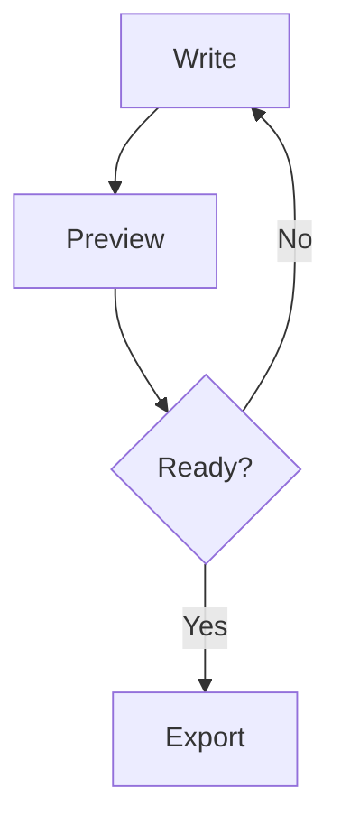
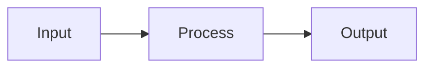

## Overview

Use this Skill when creating or revising Markdown documents intended to be edited and previewed in Markdown Studio. The goal is high readability, reliable rendering, and compatibility with export.

Apply this Skill for:

- README writing
- technical documentation
- tutorials and how-to guides
- release notes and changelogs
- architecture and design notes

## Invocation Hints

Prefer using this Skill when prompts mention:

- markdown formatting quality
- table of contents structure
- mermaid diagrams
- equations or math notation
- callouts or admonitions
- export-ready docs

## Output Rules

- Return Markdown only unless the user requests explanation.
- Use a clean heading hierarchy with sequential levels.
- Keep content portable across Markdown tools while using supported enhancements.
- Prefer concise sections and direct language.
- Use examples that are short and executable where relevant.

## Supported Rendering Features

This app supports:

- CommonMark and GFM syntax
- task lists
- tables
- fenced code blocks with language tags
- Mermaid diagrams with mermaid fences
- KaTeX math using inline and display delimiters
- callouts via quote markers: NOTE, TIP, WARNING, IMPORTANT, CAUTION
- footnotes using label references
- emoji shortcodes such as :rocket: and :sparkles:
- smart punctuation
- safe links: http, https, mailto, tel, anchors, and root-relative paths

## Authoring Patterns

### Heading Structure

Use concise, scannable headings and avoid skipping levels.

#### Example

````markdown
# API Design Notes

## Goals

## Data Model

### Validation Rules
````

### Task Lists

Use exact task syntax.

#### Example

````markdown
- [ ] Draft v1
- [x] Add tests
- [ ] Publish docs
````

### Tables

Use right-aligned numeric columns when applicable.

#### Example

````markdown
| Metric | Value | Status |
|---|---:|---|
| Coverage | 92 | Good |
| Build Time | 2.1s | Good |
````

### Code Fences

Always provide a language tag.

#### Example

````markdown
```javascript
export function sum(a, b) {
  return a + b;
}
```
````

### Mermaid

Use diagrams for flows and architecture.

#### Example

````markdown

````

### Math

Use inline math for short expressions and display math for formulas.

#### Example

````markdown
Inline: $E = mc^2$

$$
\int_{-\infty}^{\infty} e^{-x^2} dx = \sqrt{\pi}
$$
````

### Callouts

Use callouts for critical context.

#### Example

````markdown
> [!TIP]
> Keep section titles short to improve TOC readability.
````

### Footnotes

Use for references and side notes.

#### Example

````markdown
This behavior is intentional.[^intent]

[^intent]: It improves readability and reduces ambiguity.
````

## Link Rules

Preferred link forms:

- https://example.com
- http://example.com
- mailto:team@example.com
- tel:+1234567890
- #local-anchor
- /docs/reference

Avoid unsupported or unsafe protocols.

## Templates

### Technical Spec Template

````markdown
# <Title>

## Summary

## Problem

## Requirements
- <item>
- <item>

## Design


## Risks
> [!WARNING]
> <key risk>

## Validation
- [ ] Unit tests
- [ ] Integration tests
- [ ] Docs updated
````

### Tutorial Template

````markdown
# <Tutorial Title>

## Outcome

## Prerequisites

## Step 1

## Step 2

## Step 3

## Verification

## Next Steps
````

## Quality Checklist

Before returning content:

- headings are hierarchical and meaningful
- code fences are balanced and language-tagged
- mermaid blocks are syntactically valid
- math delimiters are balanced
- task list syntax is valid
- footnote refs and definitions match
- links use safe formats
- output remains readable in plain Markdown renderers

## Test Prompts

Use these to validate invocation behavior:

- Write a release note with a checklist, table, and callouts.
- Create an architecture document using Mermaid and math.
- Rewrite this README to be export-ready and TOC-friendly.

## Security Notes

- Never include secrets or credentials.
- Avoid embedding unsafe links or script-like content.
- Prefer deterministic, auditable Markdown output.
