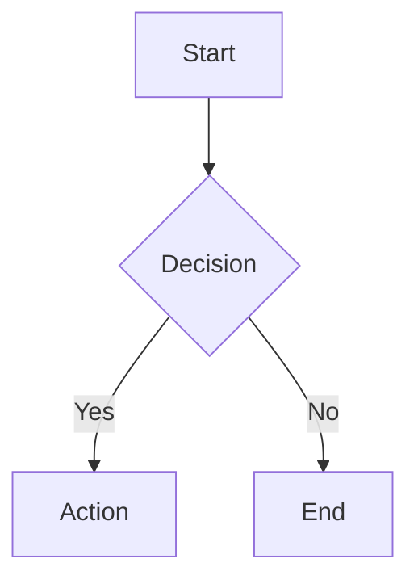

# Overview

This skill teaches correct Markdown writing and formatting for use in MarkdStudio — a browser-based Markdown editor with live preview, code editing, PDF export, and extended syntax support.

Follow these rules whenever producing Markdown content such as:

- documentation and README files
- technical notes and guides
- tutorials and knowledge base articles
- project plans, changelogs, and meeting notes

**Supporting reference files:**

- [REFERENCE.md](REFERENCE.md) — Full Markdown syntax reference
- [EXAMPLES.md](EXAMPLES.md) — Complete document examples
- [TEMPLATES.md](TEMPLATES.md) — Reusable document templates

---

# When to Use This Skill

**Use this skill whenever:**

- The user requests Markdown formatting or asks to write `.md` files
- The output should be a README, documentation, guide, or tutorial
- Converting plain text or structured content into Markdown
- Writing or formatting notes in MarkdStudio
- The user mentions: *markdown, .md file, documentation, README, formatting, MarkdStudio*

**Do not use this skill when:**

- The output is code only, with no surrounding document structure
- The user requests plain text without Markdown
- The context is a chat reply, not a document

---

# Markdown Formatting Rules

## Headings

```
# H1 — Document title (one per document)
## H2 — Major section
### H3 — Subsection
#### H4 — Minor subsection
```

Rules:

- Only one `# H1` per document
- Do not skip heading levels (H1 → H3 is not allowed)
- Leave one blank line before and after every heading

## Lists

Bullet lists for unordered items:

```
- item one
- item two
- item three
```

Numbered lists for sequential steps:

```
1. Step one
2. Step two
3. Step three
```

Task lists for actionable items:

```
- [x] Completed task
- [ ] Pending task
```

## Text Formatting

```
**bold** — important terms or key concepts
*italic* — emphasis, titles, or foreign words
~~strikethrough~~ — removed or deprecated content
`inline code` — filenames, commands, and variable names
```

## Code Blocks

Always use fenced code blocks with a language label:

````
```python
print("Hello, world!")
```
````

Supported language labels: `js`, `ts`, `python`, `bash`, `html`, `css`, `json`,
`sql`, `yaml`, `markdown`, `diff`, `plaintext`, and more.

## Tables

```
| Column A | Column B | Column C |
| -------- | -------- | -------- |
| value    | value    | value    |
```

Align separator dashes consistently. Always include a header row.

## Links and Images

```
[Link text](https://example.com)

```

Always provide descriptive alt text for images.

---

# Document Structure Rules

A standard Markdown document should follow this order:

1. **Title** — `# H1`, one per document
2. **Overview** — brief introduction, one paragraph
3. **Table of Contents** — optional, for documents over 500 words
4. **Main Sections** — `## H2` headings and deeper
5. **Examples** — concrete illustrations of the content
6. **Summary or Next Steps** — closing paragraph or checklist

---

# Formatting Standards

- Keep paragraphs under 4 lines
- Add one blank line between paragraphs and between sections
- Prefer lists over dense prose — lists are easier to scan
- Use a heading roughly every 200–300 words
- Use whitespace intentionally — tight blocks are hard to read

---

# MarkdStudio-Specific Rules

## Extended Syntax

**Math (KaTeX):**

Inline: `$E = mc^2$`

Block:

```
$$
\int_0^\infty e^{-x^2}\,dx = \frac{\sqrt{\pi}}{2}
$$
```

**Diagrams (Mermaid):**

````

````

**Callouts:**

```
> [!NOTE]
> Used for informational side notes.

> [!TIP]
> Used for helpful tips and suggestions.

> [!WARNING]
> Used for important warnings.

> [!IMPORTANT]
> Used for critical information.

> [!CAUTION]
> Used for potential risks or destructive actions.
```

**Footnotes:**

```
A statement with a reference.[^1]

[^1]: The footnote definition goes here.
```

**Emoji shortcodes:** `:rocket:` `:sparkles:` `:white_check_mark:` `:warning:`

**Inline HTML (use sparingly):**

| Tag | Purpose |
| --- | ------- |
| `<kbd>Ctrl+S</kbd>` | Keyboard keys |
| `<mark>text</mark>` | Highlighted text |
| `<sup>1</sup>` | Superscript |
| `<sub>x</sub>` | Subscript |

## Attribution

MarkdStudio appends the following line when downloading Markdown:

```
[Rendered best with MarkdStudio](https://markdstudio.netlify.app)
```

- This line is hidden in the in-app preview.
- Do not remove it from exported or downloaded files.

## Export Compatibility

- Keep Markdown portable — avoid app-specific syntax when output may be used on GitHub or in static site generators.
- For PDF export, use clean heading structure and properly closed code blocks.
- Avoid very wide tables — they may overflow in PDF output.

---

# Output Requirements

All Markdown generated by this skill must:

- Be valid, renderable Markdown
- Use correct heading hierarchy (no skipped levels)
- Include blank lines between sections and before headings
- Use fenced code blocks with language labels
- Avoid unnecessary HTML when Markdown syntax is sufficient
- Be readable in both rendered view and raw plain text
- Work correctly in MarkdStudio's preview and export pipeline

---

# Examples

See [EXAMPLES.md](EXAMPLES.md) for full-length document examples.

**Short example — README structure:**

````markdown
# Project Name

## Overview

A short description of what this project does.

## Installation

```bash
npm install project-name
```

## Usage

```js
import Project from 'project-name';
```

## License

MIT
````

**Short example — technical note with callout:**

````markdown
# API Integration Notes

> [!TIP]
> Always authenticate before making data requests.

## Authentication

Pass a Bearer token in the Authorization header.

```bash
curl -H "Authorization: Bearer <token>" https://api.example.com/status
```

## Checklist

- [x] Handle 401 Unauthorized
- [ ] Handle rate limiting
- [ ] Add retry logic
````

---

# Common Mistakes

Avoid these errors:

- Skipping heading levels — H1 directly to H3 breaks structure
- Missing blank lines before headings and code blocks
- Fenced code blocks without a language label
- Large wall-of-text paragraphs with no structure
- Mixing `-` and `*` bullet markers in the same list
- Using HTML tags when standard Markdown covers the need
- Omitting alt text on images
- Starting a document without an `# H1` title
- Nested code fences using the same delimiter — use `~~~` inside ```` ``` ```` blocks

## Compatibility Notes

- MarkdStudio appends attribution only when downloading markdown.
- In-app preview hides the attribution line for cleaner editing.
- Keep generated markdown portable to GitHub and static-site pipelines.
